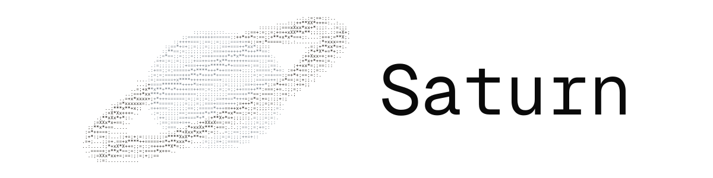

  <picture>
    <source media="(prefers-color-scheme: dark)" srcset="public/art/logo-landscape-dark.png" />
    <source media="(prefers-color-scheme: light)" srcset="public/art/logo-landscape-light.png" />
    
  </picture>

## Saturn

No-code workflows for everything.

Create:

- Agentic automations
- Discord/Telegram bots
- Content creation workflows
- So much more

With:

- Persistent Linux sandboxes
- Persistent `pgvector`-based agent memory 
- No-code node based workflows
- And more

## License

[PolyForm Noncommercial 1.0.0](LICENSE.md) - free to use, modify, and share for any noncommercial purpose.