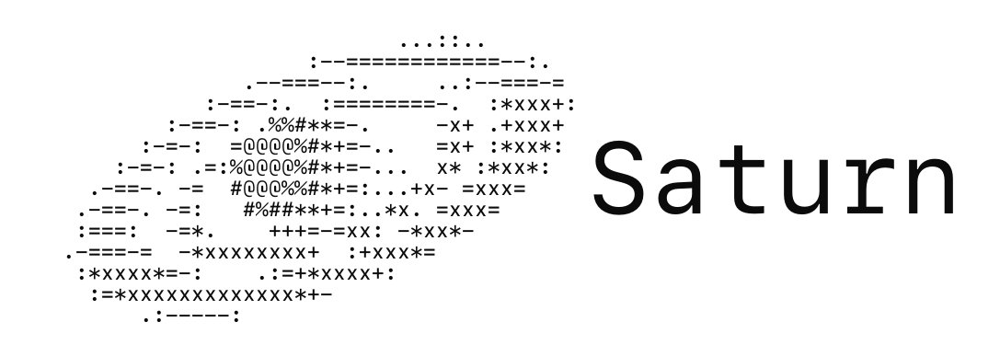
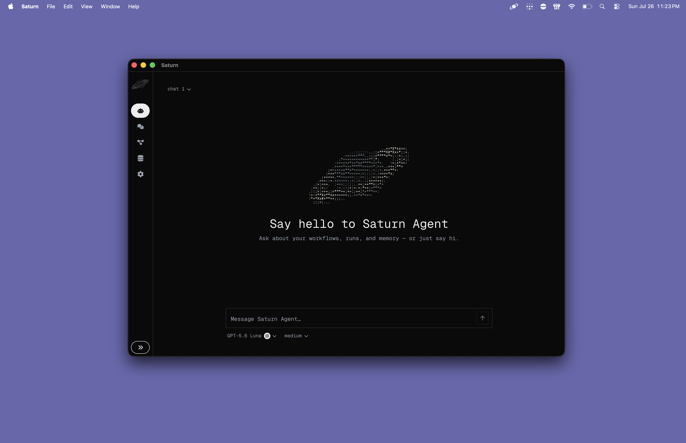

  <picture>
    <source media="(prefers-color-scheme: dark)" srcset="public/art/logo-landscape-dark.png" />
    <source media="(prefers-color-scheme: light)" srcset="public/art/logo-landscape-light.png" />
    
  </picture>

## Saturn

Saturn is Wilcus Industries' latest innovation in personal agent technology.

<small>It's beautiful, I know.</small>

### Agent specifications
- [turbovec](https://github.com/RyanCodrai/turbovec) based agent memory.
- Rust based app backend (under 300mb ram, instant speed).
- Beautifully designed TypeScript UI.
- 300+ models via OpenRouter.

### Automations
- No-code event driven workflows.
- Rust interpreter for maximum speed.
- MCP for agentic workflow creation.

## License

[MIT](LICENSE.md)